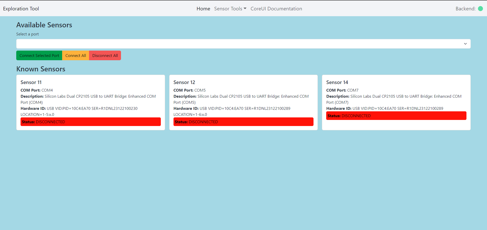
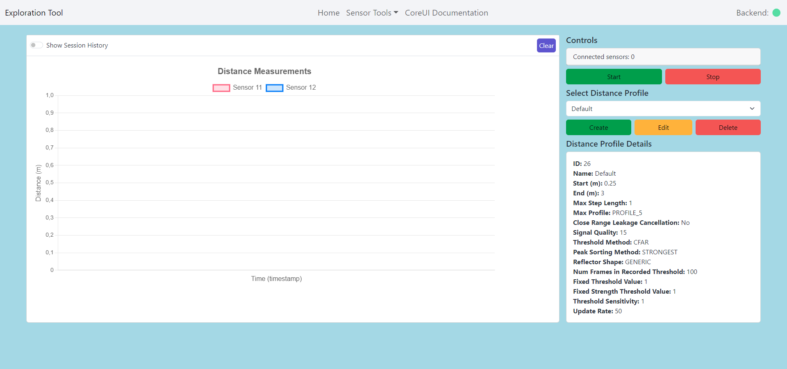
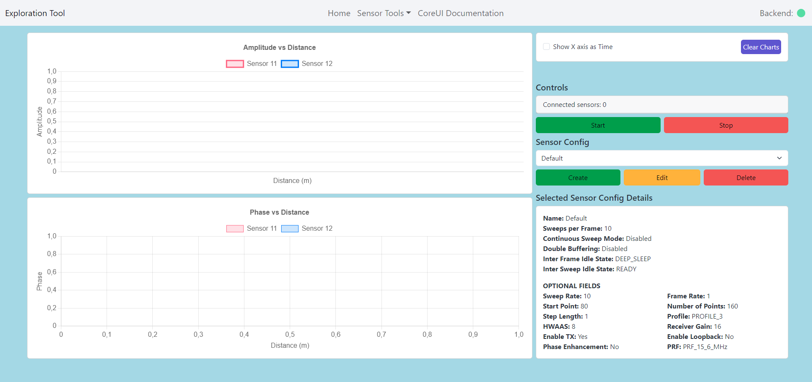

# Annual Project (NPRG045)

## Web Application for Sensor Communication

### Project Overview

This project aims to develop a web application that communicates with a sensor connected via a COM port. The application allows users to perform measurements (e.g., distance, amplitude, phase) and log results into a database. Key features include:

-   Connecting to a sensor via a COM port
-   Real-time display of measured data
-   Setting up all sensor properties
-   Reviewing measuring sessions

[Detailed Project Specification in Czech](./docs/program_specification_cz.md)

## Gallery

### Home Page



### Distance Detector



### Amplitude and Phase Detector



## Technologies Used

### Frontend

-   Vite + React
-   TypeScript
-   CoreUI React Library

### Backend

-   Python
-   Django
-   SQLite3 (upgradeable to MySQL)
-   Neural Network for data processing (TBD)

### Communication Protocols

-   **REST API:** For frontend-backend communication.
-   **PySerial:** For connecting the backend to the sensor via the COM port.
-   **WebSocket:** For bidirectional communication between the backend and the frontend.

Here is an installation guide for your `README.md` based on the terminal setup and settings you provided:

---

## Installation Guide

### Prerequisites

Before you start, ensure you have the following installed on your system:

-   **Python 3.12** (for the backend)
-   **Django** (for the backend server)
-   **Celery** and **Redis** (for task queue and scheduling)
-   **Node.js** with **npm** (for the frontend)
-   **WSL** (for Redis if using Windows Subsystem for Linux)

You can see al the python environment details in the [requirements.txt](requirements.txt) file for the backend and [package.json](./frontend/package.json) for the frontend.

### Setup Instructions

1. **Clone the Repository**

    Clone the project repository to your local machine:

    ```bash
    git clone https://github.com/S1lence-z/NPRG045.git
    cd NPRG045
    ```

2. **Backend Setup**

    Navigate to the `backend` directory:

    ```bash
    cd backend
    ```

    Install the required Python dependencies using `pip`:

    ```bash
    pip install -r requirements.txt
    ```

    Set up the Django project by migrating the database:

    ```bash
    python manage.py migrate
    ```

3. **Frontend Setup**

    Navigate to the `frontend` directory:

    ```bash
    cd frontend
    ```

    Install the frontend dependencies:

    ```bash
    npm install
    ```

4. **Redis Setup (for Celery)**

    If you're using **WSL** on Windows, make sure Redis is running inside WSL. In a new terminal, start WSL:

    ```bash
    wsl
    ```

    Inside WSL, run Redis:

    ```bash
    redis-server
    ```

5. **Running the Application**

    Open separate terminals for each part of the application. Use the following commands in each terminal:

    - **Backend (Django server):**

        ```bash
        cd backend
        python manage.py runserver
        ```

    - **Frontend (React app):**

        ```bash
        cd frontend
        npm run dev
        ```

    - **Celery Worker:**

        ```bash
        cd backend
        celery -A core worker -l info --pool=solo
        ```

    - **Celery Beat (Scheduler):**

        ```bash
        cd backend
        celery -A core beat -l INFO --scheduler django_celery_beat.schedulers:DatabaseScheduler
        ```

6. **Accessing the Application**

    - The **backend** (Django) will be available at `http://127.0.0.1:8000`.
    - The **frontend** (React) will be available at `http://localhost:3000`.

---

## Contact

For any questions or feedback, please contact [j3.zelenka@gmail.com](mailto:j3.zelenka@gmail.com).
